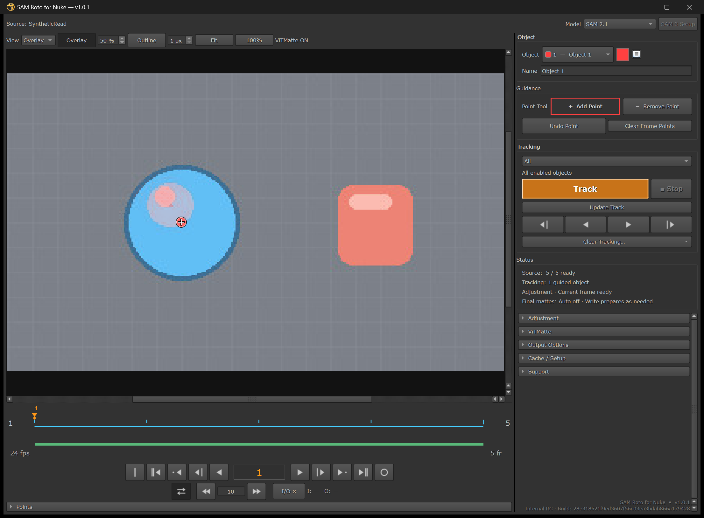
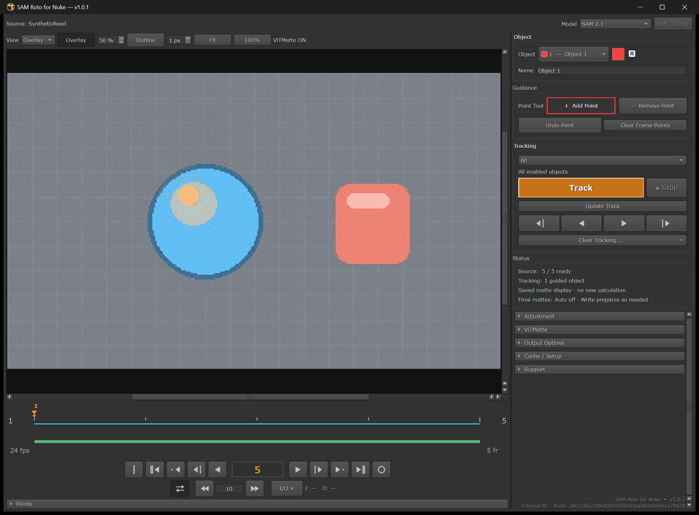
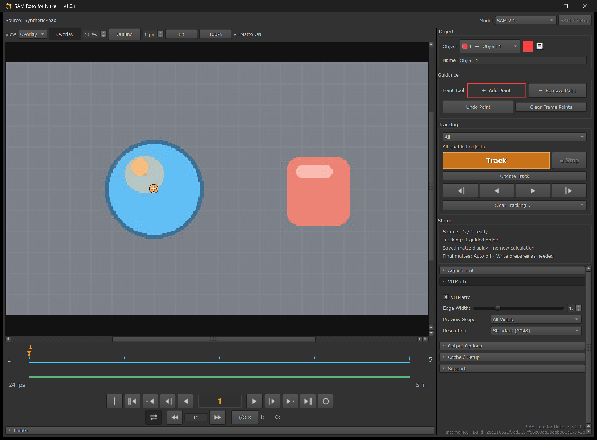
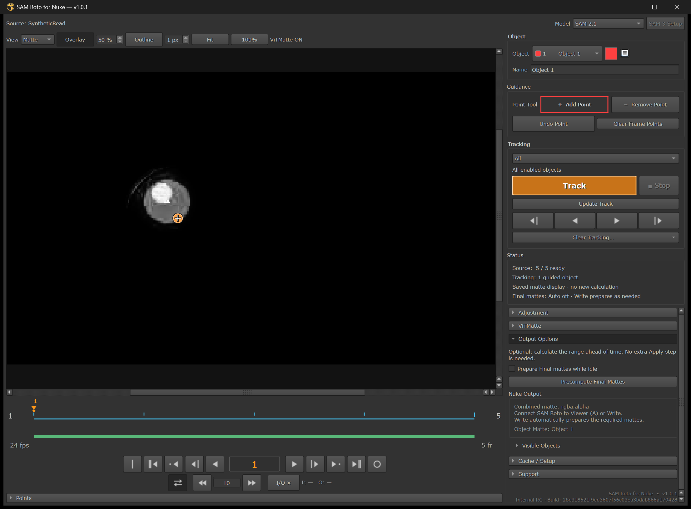

# インストールから最初のMatteまで

[English](QUICKSTART_EN.md) · [v1.0.0ダウンロード](https://github.com/MoriKouta/SAM-Roto-for-Nuke-Releases/releases/tag/v1.0.0)

**ダウンロード → Full Setup → 起動 → Source準備 → Point → Track／修正 → ViTMatte → alpha／Write**

Windows／Linux x86_64と **NVIDIA CUDA GPU** が必要です。Nuke 15.2／16.0／16.1／17.xが互換対象です。
全OS／Nuke／GPUの組み合わせで検証完了しているわけではありません。
macOS、CPUのみ／AMDのみ／Intelのみの推論はv1.0.0では非対応です。
install／RepairにはInternetが必要です。標準setupは20 GBの空き＋shot cacheの容量を確保してください。

## 1. ダウンロードとFull Setup

1. **[SAM-Roto-for-Nuke-v1.0.0.zip](https://github.com/MoriKouta/SAM-Roto-for-Nuke-Releases/releases/download/v1.0.0/SAM-Roto-for-Nuke-v1.0.0.zip)** を取得・展開します。
2. 作業を保存し、NukeとSAM Roto backendを終了してから、展開したfolderを開きます。
3. Windowsは **install_windows.bat**、Linuxは **install_linux.sh** を実行します。
4. **Install SAM Roto** を押し、**SAM Roto is ready** まで待って **Finish**。

system Python／Git／pip command／startup編集は不要です。Full SetupでPython／PyTorch、
SAM2／2.1 Base+とViTMatteのモデルを取得します。uvとSAM sourceはZIP内に同梱されています。
準備後のPoint／Track／ViTMatteはlocalモデルを使います。Repair／更新用にinstallerは保持してください。
Linuxはdesktop UIが利用できなければterminalへfallbackします。必要ならPropertiesからファイルの実行を許可してください。

| Install | Finish |
| --- | --- |
|  |  |

*Windowsのv1.0.0 installer／Full Setup完了の実際の画面です。*

## 2. 起動とSource準備

Nukeを再起動し、画像／Source nodeを選択して **SAM Roto → Open SAM Roto**。
初回Setupは次の設定から始めます。

| 項目 | 最初の選択 |
| --- | --- |
| Frame Range | **Full Range**。必要な部分だけならProject Range／Custom |
| Cache Location | **Local Cache (Recommended)** |
| Source Color | **Auto (Recommended)** |

**Prepare Source** を押し、Source Readyまで待ちます。有効なCacheは再利用します。
Trackでは必要rangeを準備してください。**Current Frame** は1frameだけを準備します。
**Next to Nuke Script** は.nk保存後に選択可能。任意の書き込み可能folderは **Custom Folder** で選びます。
あとから変更する場合は **Cache / Setup** を使い、shotのCache folderを参照できる状態に保ってください。

## 3. Pointを追加

標準の **SAM 2.1** を選びます。Objectを選択し、**Add Point** で対象の内側をクリック。
**Remove Point** は背景／除外側のguidanceを追加する操作で、既存Pointの削除ではありません。
Point操作を戻すときは **Undo Point**。別Matteにしたい対象は別Objectを作ります。

*以下のEditor画像は、**private 1.0.1更新テストfixture** の実際のWindowsウィンドウです。
保存済みsynthetic Source／Matteを表示した操作位置の参考で、正式v1.0.0のスクショではありません。
撮影時に新たな推論／Track／Writeは行っておらず、品質比較の画像でもありません。*

*Point操作と保存済みsynthetic Matte。private 1.0.1 fixture。*

## 4. Trackと修正

tracking range／In–Outを設定し、**Track** で未完了frameを進めます。
結果をscrubして確認し、難しいframeへforeground／backgroundの修正Pointを追加。
修正したいIn–Outを設定して **Update Track** で既存結果を再計算します。
**Track** は未完了frameの続行、**Stop** は実行中の処理を停止して完成frameを保持します。
guidanceのないObjectはskipし、他ObjectのTrackは進めます。
方向を限定する場合はTrack直下の矢印buttonから直接実行します。

*frame 5とtimelineの保存済みデータ表示。private 1.0.1 fixture。撮影時の新規Trackではありません。*

## 5. Adjustmentと任意のViTMatte

**Adjustment** でFill Holes／Remove Specks／Grow / Shrink／Feather／Close Gapsを調整します。
Global AdjustmentはNode Propertiesにもあり、同じStateを共有します。
Object別に変えたい場合だけ **Object Override** を使います。

必要なら **ViTMatte** を有効にしてcurrent frameのedgeを確認します。
Matteを調整する機能で、tracking modelではありません。追加GPU負荷があります。
モデルは標準Full Setupで準備済みです。

*ViTMatte操作と保存済みMatte。private 1.0.1 fixture。OFF／ON比較ではありません。*

## 6. alphaとWrite

SAM Roto GroupをNuke Viewerにつなぎ、**A** で **rgba.alpha** を確認します。
RGBはSourceを保持し、alphaは有効Objectを合成します。Object別出力は
**Node Properties → Output → Object Matte → Create Object Matte**。

**Write** を接続し、Nuke GUIから通常どおりRenderします。必要なFinal Matteはprogressを表示して準備し、
完了後は元のRenderを自動続行します。Cancelは待機中のRenderも中止します。
**Output Options → Precompute Final Mattes** は任意の事前準備で、通常の必須操作ではありません。

*保存済みMatte ViewとOutput Options。private 1.0.1 fixture。新たなNuke alpha／Write検証ではありません。*

## 更新・復旧・問い合わせ

- 更新：作業保存 → Nuke／backend終了 → 新しい承認済みinstaller。互換runtime／モデルとArtistの
  Cache／Points／Tracking／Stateを保持します。事前uninstallは不要です。
- 不足componentは同じinstallerの **Repair**。setup修復のために有効Cacheを削除しないでください。
- CUDA／backendエラーは **Support → Logs / Copy Diagnostics**。送信前に画像・logの機密情報を確認してください。
- 開発checkoutは **DEV Sync + Reload** を継続します。通常のDEV profileへ公開版を上書きしないでください。

Windows SAM3／3.1は利用不可。LinuxはExperimentalでinstaller Advancedと承認済みHF accessが必要です。
Farm／Nuke -t／-xで自動推論・Final準備は行いません。準備済みCache／runtimeを渡すか標準nodeへベイクします。
Get ColorとCtrl+Shift+C custom hotkeyは未搭載です。

[詳細install／復旧](INSTALLATION_JA.md) · [Release notes](RELEASE_NOTES_1.0.0_JA.md) ·
[画像URL／キャプション](SCREENSHOTS.md) · [ライセンス／第三者通知](../THIRD_PARTY_NOTICES.md)
