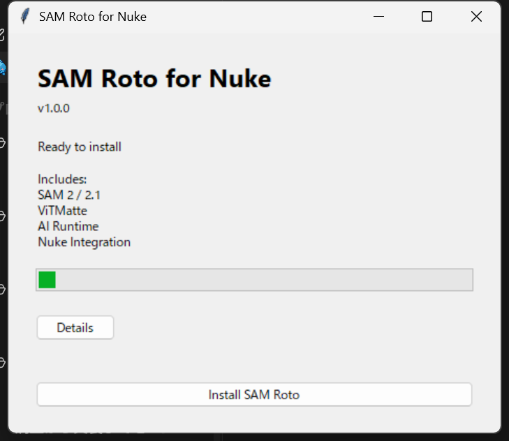
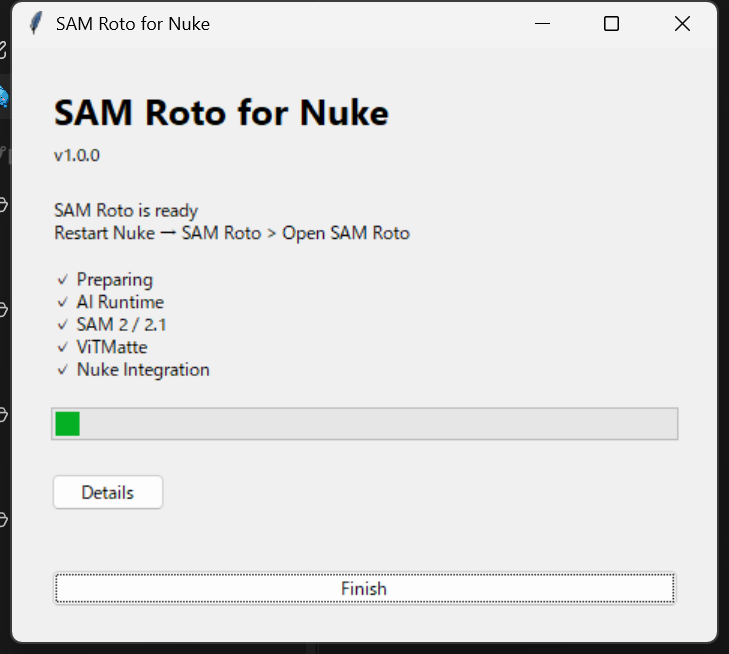
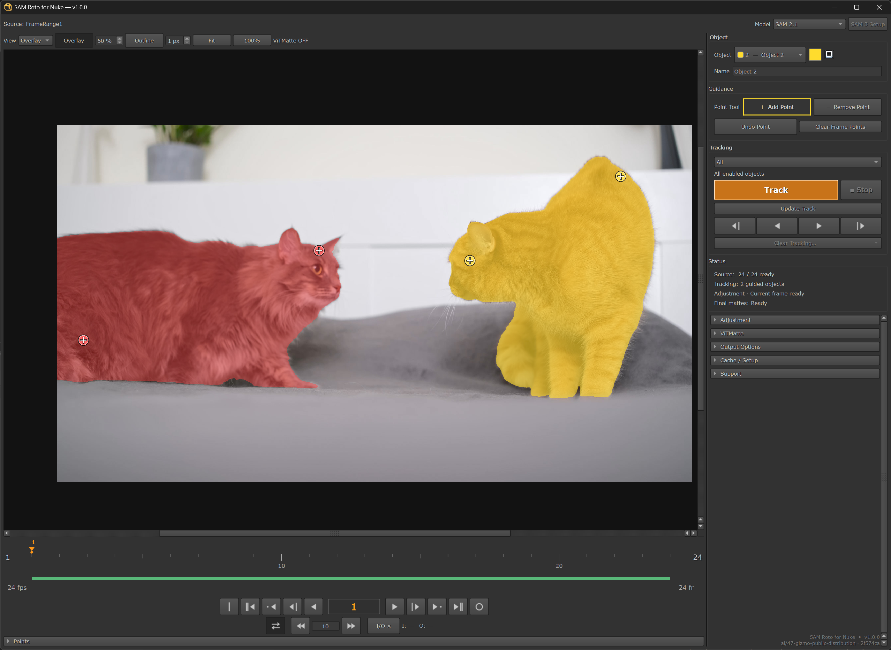
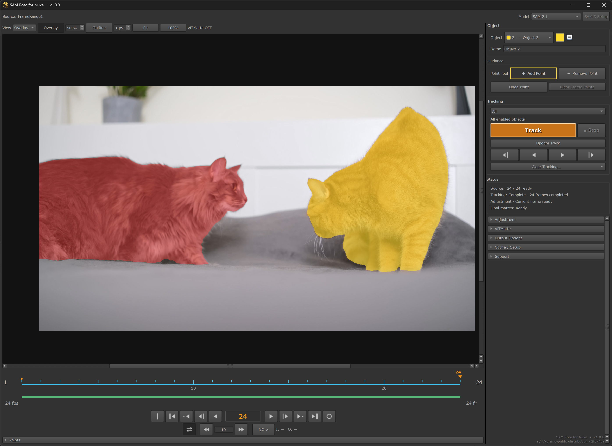
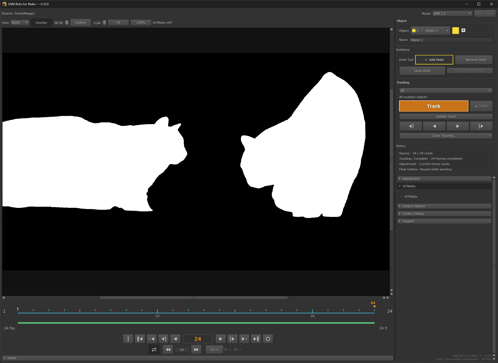
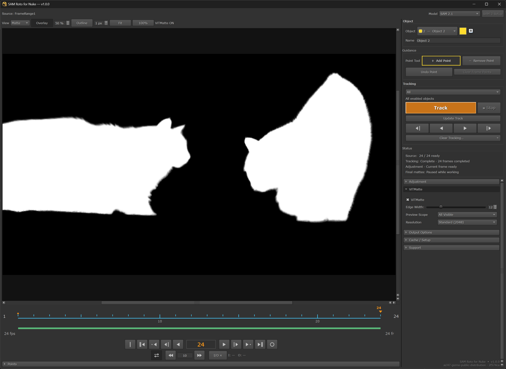
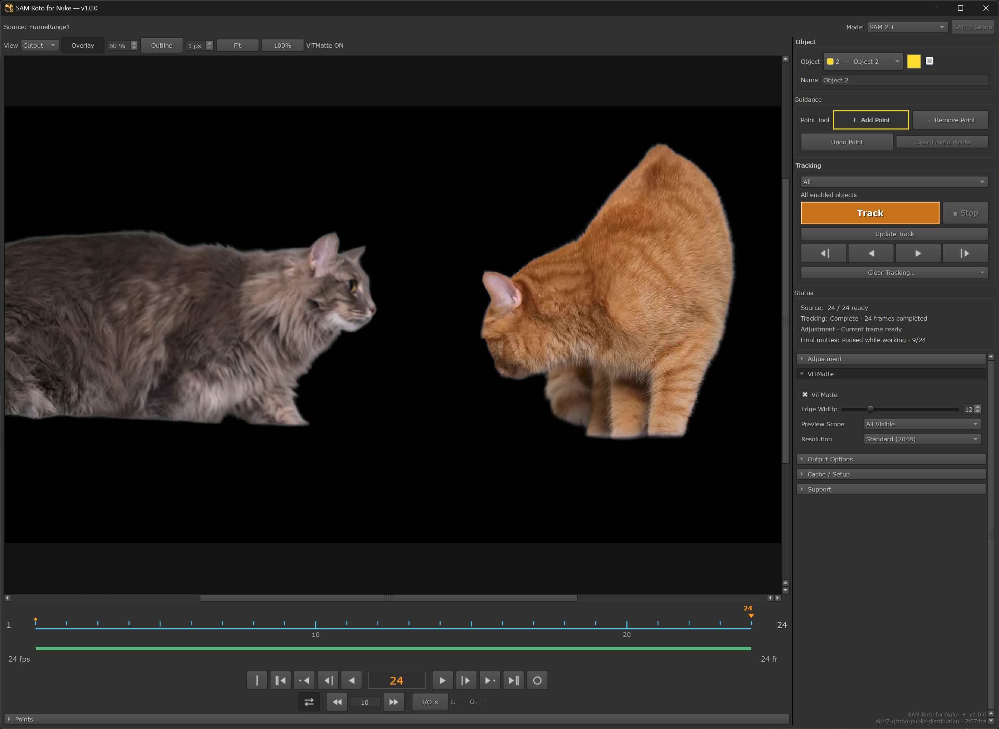

# SAM Roto：SelectからTrack、Matte調整まで

現在の公開版は **v1.1.0** です。[変更点／検証範囲](RELEASE_NOTES_1.1.0_JA.md)。

[English](QUICKSTART_EN.md)

Nuke内でPointから対象を指定し、shotをTrack。任意のViTMatteで輪郭を比較・調整し、MatteをNukeへ出力します。

**Full Setup → Source準備 → Select → Track／修正 → ViTMatte OFF／ON → Cutout → alpha／Write**

Windows／Linux x86_64と **NVIDIA CUDA GPU** が必要です。Nuke 15.2／16.0／16.1／17.xが互換対象です。
全OS／Nuke／GPUの組み合わせで検証完了しているわけではありません。
v1.1.0のGUI／GPU、Fresh Install／Repair、In-App Updaterの終了・再起動・データ保持は実機未検証です。
macOS、CPUのみ／AMDのみ／Intelのみの推論はv1.1.0では非対応です。
install／RepairにはInternetが必要です。標準setupは20 GBの空き＋shot cacheの容量を確保してください。

## 1. ダウンロードとFull Setup

1. **[SAM-Roto-for-Nuke-INSTALLER.zip](https://github.com/MoriKouta/SAM-Roto-for-Nuke-Releases/releases/latest/download/SAM-Roto-for-Nuke-INSTALLER.zip)** を取得・展開します。
2. 作業を保存し、すべてのNukeを終了してから、展開したfolderを開きます。
3. Windowsは **install_windows.bat**、Linuxは **install_linux.sh** を実行します。
4. **Install SAM Roto** を押し、**SAM Roto is ready** まで待って **Finish**。

現在の公開版は **[v1.1.0](https://github.com/MoriKouta/SAM-Roto-for-Nuke-Releases/releases/tag/v1.1.0)**。固定Installer URLは今後の最新版を取得します。
GitHubのSource code ZIPはInstallerではありません。
初回Full Setupの目安は **10〜30分**。回線・disk・PC環境によってさらに時間がかかります。

system Python／Git／pip command／startup編集は不要です。Full SetupでPython／PyTorch、
SAM2／2.1 Base+とViTMatteのモデルを取得します。uvとSAM sourceはZIP内に同梱されています。
準備後のPoint／Track／ViTMatteはlocalモデルを使います。Repair／更新用にinstallerは保持してください。
Linuxはdesktop UIが利用できなければterminalへfallbackします。必要ならPropertiesからファイルの実行を許可してください。

| Install | Finish |
| --- | --- |
|  |  |

*Windowsのv1.0.0 installer／Full Setup完了の実際の画面です。*

## 2. 起動とSource準備

Nukeを再起動し、画像／Source nodeを選択 → **Tab → SAM Roto**。
作成されたSAM Roto Groupの **Properties → Open Editor** からEditorを開きます。
初回Setupは次の設定から始めます。

| 項目 | 最初の選択 |
| --- | --- |
| Frame Range | **Full Range**。必要な部分だけならProject Range／Custom |
| Cache Location | **Local Cache (Recommended)** |
| Source Color | **Auto (Recommended)** |

**Prepare Source** を押し、Source Readyまで待ちます。有効なCacheは再利用します。
Trackでは必要rangeを準備してください。**Current Frame** は1frameだけを準備します。
**Next to Nuke Script** は.nk保存後に選択可能。任意の書き込み可能folderは **Custom Folder** で選びます。
あとから変更する場合は **Cache / Setup** を使い、shotのCache folderを参照できる状態に保ってください。

## 3. Select — 対象をPointで指定

**SAM 2.1** を選び、Objectごとに **Add Point** で対象の内側をクリックします。
別Matteにしたい対象は別Objectにします。色付きoverlayで2対象を見分けられます。
**Remove Point** は背景／除外のguidanceを追加する操作です。Point編集を戻す場合は **Undo Point**。

*Select — frame 1。Add Pointで2対象を指定し、赤／黄のoverlayで確認。*

## 4. Track — shotを追い、必要なframeを修正

range／In–Outを設定し、**Track** で未完了frameを進めます。scrubして結果を確認します。
難しいframeへ修正Pointを追加し、対象In–Outを設定して **Update Track** で既存結果を再計算します。
**Stop** は完成frameを保持。guidanceのないObjectはskipします。矢印buttonは方向を限定して直接Trackを開始します。

*Track — frame 24。2対象のoverlayと、Statusの24 frames completed表示。*

## 5. ViTMatte OFF／ON — 輪郭を比較

Viewを **Matte** にし、同じframeで **ViTMatte** をOFF／ONして輪郭を確認します。
ViTMatteは任意のedge調整で、Tracking modelではありません。追加GPU負荷があります。
モデルは標準Full Setupで準備します。自分のshotでも結果を確認してください。

| ViTMatte OFF · frame 24 | ViTMatte ON · frame 24 |
| --- | --- |
|  |  |

*同じframeのMatte Viewで輪郭を比較できます。すべてのshotで同じ効果を保証するものではありません。*

軽い調整は **Adjustment** のFill Holes／Remove Specks／Grow / Shrink／Feather／Close Gaps。
Node PropertiesとEditorのGlobal Adjustmentは同じStateを共有します。対象別の変更だけ **Object Override** を使います。

## 6. Cutout — current frameの切り抜きを確認

Viewを **Cutout** にすると、現在のMatteで切り抜いた対象を黒背景で確認できます。
出力前の確認用previewであり、全frameがRender準備完了という意味ではありません。

*Cutout — frame 24のcurrent-frame preview。Final mattesは9/24でpaused。Write完了画像ではありません。*

操作画像は、v1.0.0表示の開発checkout（build 2f574ca）で撮影したユーザー提供例です。公開v1.0.0 ZIP（a2545b9）やv1.1.0のnative acceptance証拠ではありません。Cutoutはcurrent frameのpreviewで、全Final MatteやWriteの完了を示しません。

## 7. alphaとWriteへ

SAM Roto GroupをNuke Viewerにつなぎ、**A** で **rgba.alpha** を確認します。
RGBはSourceを保持し、alphaは有効Objectを合成します。Object別出力は
**Node Properties → Output → Object Matte → Create Object Matte**。

**Write** を接続してNuke GUIでRenderします。必要なFinal Matteはprogressを表示して準備し、
完了後は元のRenderを自動続行します。Cancelは待機中のRenderも中止します。
**Output Options → Precompute Final Mattes** は任意の事前準備です。

**[最新版Installerをダウンロード](https://github.com/MoriKouta/SAM-Roto-for-Nuke-Releases/releases/latest/download/SAM-Roto-for-Nuke-INSTALLER.zip)** · [English guide](QUICKSTART_EN.md)

## 更新・復旧・問い合わせ

- In-App Updater対応のPublic installは、SAM Windowを開いた後、最大24時間に1回Stable更新を確認します。
  **Support → Check for Updates** でも手動確認できます。更新があれば **Update** で取得・検証し、
  作業を保存して **Install & Restart Nuke**。Source準備／Track／Renderを終えてから実行してください。
  取得中は稼働コードを置換しません。Save／終了のCancel時はinstallしません。
- 旧版などUpdater非対応、またはruntime／モデル非互換なら、上記Installerを使用します。
  作業保存 → すべてのNuke終了 → Installerの **Update／Repair**。所有を証明できる残存backendは
  installerが正常終了し、不明なlistener／processがあれば更新を止めます。無関係なprocessは終了しません。
  互換runtime／モデルとArtistのCache／Points／Tracking／Stateを保持します。事前uninstallは不要です。
- 不足componentは同じinstallerの **Repair**。setup修復のために有効Cacheを削除しないでください。
- CUDA／backendエラーは **Support → Logs / Copy Diagnostics**。送信前に画像・logの機密情報を確認してください。
- 開発checkoutは **DEV Sync + Reload** を継続します。通常のDEV profileへ公開版を上書きしないでください。

Windows SAM3／3.1は利用不可。LinuxはExperimentalでinstaller Advancedと承認済みHF accessが必要です。
Farm／Nuke -t／-xで自動推論・Final準備は行いません。準備済みCache／runtimeを渡すか標準nodeへベイクします。
Get ColorとCtrl+Shift+C custom hotkeyは未搭載です。

[詳細install／復旧](INSTALLATION_JA.md) · [Release notes](RELEASE_NOTES_1.1.0_JA.md) ·
[画像URL／キャプション](SCREENSHOTS.md) · [ライセンス／第三者通知](../THIRD_PARTY_NOTICES.md)
